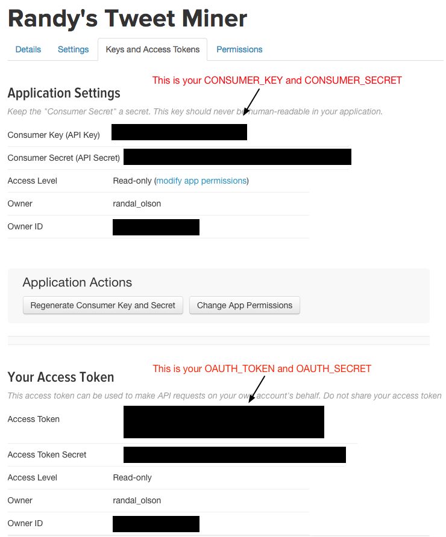

# Follower Factory analysis script

This Python script was inspired by the New York Times' [Follower Factory article](https://www.nytimes.com/interactive/2018/01/27/technology/social-media-bots.html), which showed that Twitter accounts can be analyzed to discover whether someone has purchased fake followers for that account. This script enables you to analyze any Twitter account and generate a similar scatter plot visualization of their followers. You can typically tell when someone purchased fake followers for an account when there are solid lines of followers that were created around the same time, as shown in the New York Times article.

## Dependencies

You will need to install Python's [python-twitter](https://github.com/sixohsix/twitter/) library:

    pip install twitter

You will also need to create an app account on https://dev.twitter.com/apps

1. Sign in with your Twitter account
2. Create a new app account
3. Modify the settings for that app account to allow read & write
4. Generate a new OAuth token with those permissions

Following these steps will create 4 tokens that you will need to place in the script, as discussed below.

## Usage

Before you can run this script, you need to fill in the following 5 variables in the file:

```Python
USER_TO_ANALYZE = ''
OAUTH_TOKEN = ''
OAUTH_SECRET = ''
CONSUMER_KEY = ''
CONSUMER_SECRET = ''
```

`USER_TO_ANALYZE` is straightforward: If you want to analyze my Twitter account, you would enter `randal_olson` in between the two single quotes.

Once you've created the Twitter app account as described under the Dependencies section, you should be able to find the OAUTH and CONSUMER keys on the "Key and Access Tokens" section, as shown in the image below.



Once you've filled out those 5 variables, run the script on your command line:

```Python
python follower_factory.py
```

If you're analyzing an account with 100,000s or more of followers, running the script may take a while as the script follows the Twitter API's usage restrictions. A progress bar will keep you updated on the progress of the analysis.

Once the script finishes, it will save an image to the directory that you ran the script in. That image will contain the scatter plot visualization for the account you targeted.

## Questions and Comments

If you have any questions or comments, please [file an issue on this repository](https://github.com/rhiever/Data-Analysis-and-Machine-Learning-Projects/issues/new) and I'll get back to you as soon as I can. If you'd like to submit a pull request to improve this script in any way, please file an issue first to discuss your change(s). I'm generally open to accepting pull requests on this repository.
